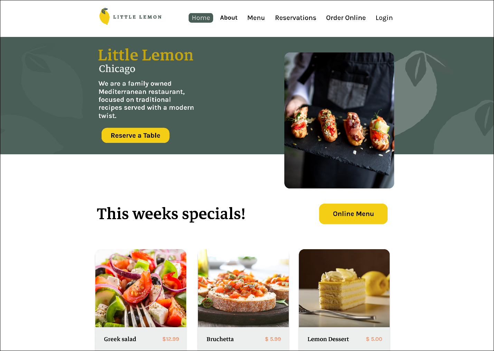
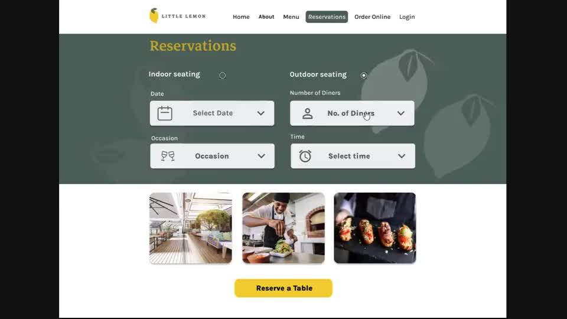
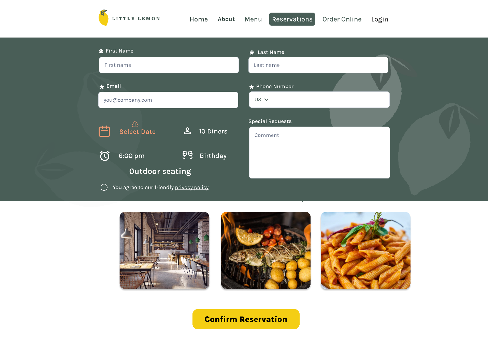
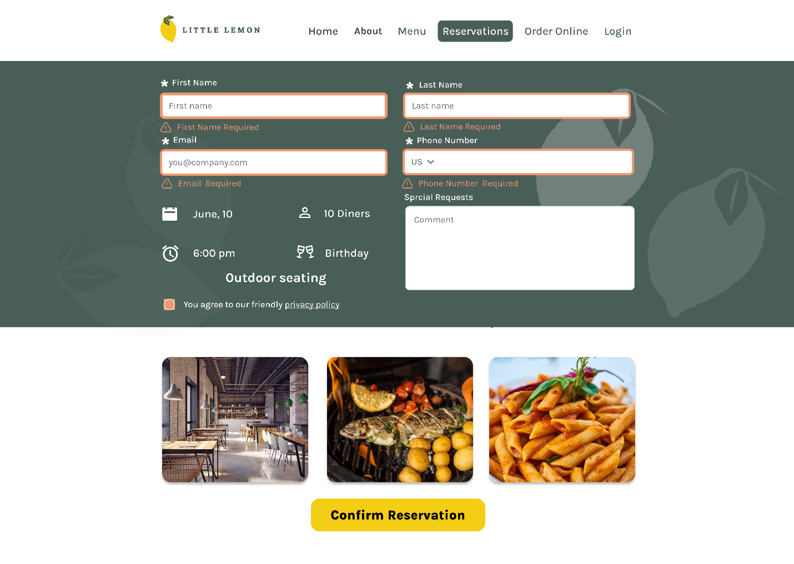
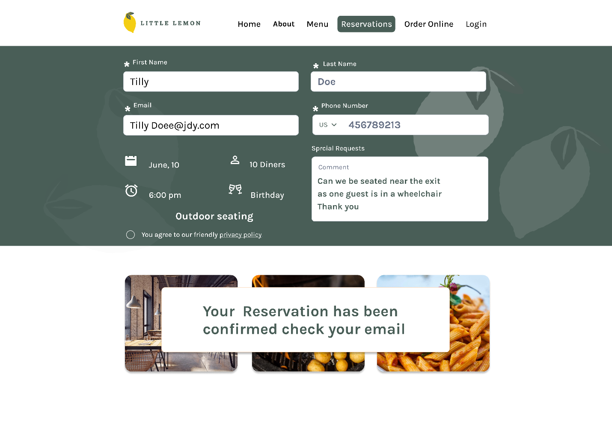

##Solution: Booking a table on the Little Lemon website
Overview

--------
Save suggestions for future editing
[link full](https://www.coursera.org/learn/meta-front-end-developer-capstone/supplement/QCzgi/solution-booking-a-table-on-the-little-lemon-website)
-------

Congratulations! You’ve completed your Little Lemon web app along with your peers and are now ready to review the work that’s been done.

The following screens are a possible solution for your projects and the design proposed may vary. However, although the designs may vary, the screens do need to contain the required elements described for each.

Make sure to check that screens you are reviewing contain the required elements as described in each item.

SCREEN 1: Home screen

Your solution needs to link the reserve-a-table button to your next screen.

Little Lemon Home page
This screen needs to feature:

An element to input the date.

An element to input the time.

An element to input the number of diners.

An element to input the occasion.

A button to link to the next screen.

Additionally, the screen should encompass the look and feel of the Little Lemon restaurant brand as per the style guide provided.

Little Lemon Reservation page, reserve a table.
This screen needs to capture the customer details, including:

Customer’s first and last name.

Contact information, such as phone or email.

Required fields should be indicated.

A button to confirm or submit the customer information.

Option to confirm selection (optional).

Once again, the screen should encompass the look and feel of the Little Lemon restaurant brand as per the style guide provided.

Little Lemon reservation profile page
If the customer forgets to input details, they should be presented with relevant warnings.

Little Lemon reservation profile page
Once the customer has completed and submitted the reservation form, they should receive confirmation of their submission.

Little Lemon reservation confirmation message
Video solution
Conclusion
Congratulations, you have demonstrated multiple skills learned during this program by composing a modern front-end application for the Little Lemon restaurant. 

You are so close to completing this Capstone Project course. All your hard work thus far, in this course and in others in the Front-End program, has prepared you for the graded quiz that will follow. Best of luck!